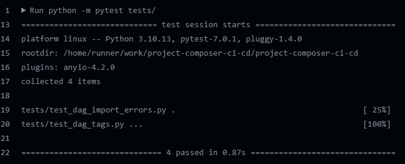
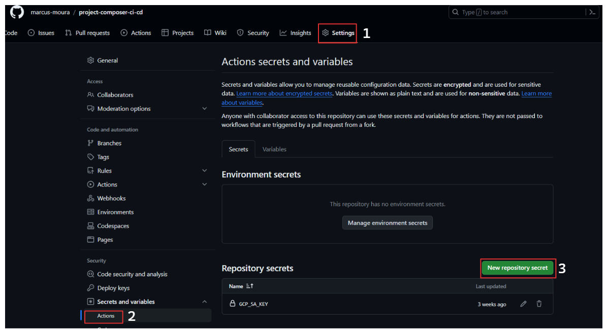
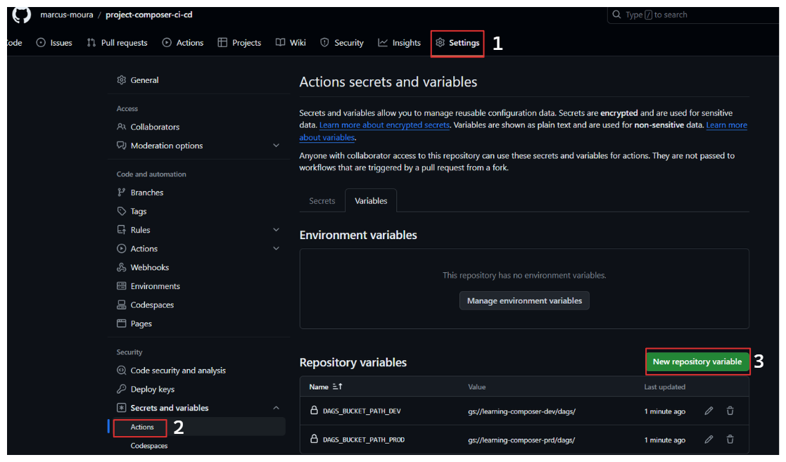

# Composer CI/CD Dags
## Descrição
Este projeto automatiza o processo de implantação de DAGs do Cloud Composer usando pipelines de CI/CD. Ele envolve a criação de instâncias do Composer com Terraform, configuração de DAGs de exemplo e arquivos de teste, e configuração de jobs de CI/CD para ambientes de desenvolvimento e produção.

## Documentação do Projeto
[Documentação](https://marcus-moura.github.io/project-composer-ci-cd/)

## Estrutura do Projeto

```bash
├── .github/workflows
│   ├── pipeline-composer-dags-dsv.yml
│   ├── pipeline-composer-dags-prd.yml
├── create_composer_instance
│   ├── backend.tf
│   ├── main.tf
│   ├── variables.tf
│   ├── dev.tfvars
│   ├── prod.tfvars
├── dags
│   ├── dag.py
├── tests
│   ├── test.py
├── .gitignore
├── requirements.txt
├── requirements-test.txt
├── README.md
``````

## Requisitos

Certifique-se de ter os seguintes pré-requisitos instalados:

- [Terraform](https://www.terraform.io/)
- [Google Cloud SDK](https://cloud.google.com/sdk)
- [Python](https://www.python.org/)
- [Poetry](https://python-poetry.org/docs/)

## Instalação

Para a instalação do projeto, siga as instruções abaixo:

### Clonando o Repositório

Clone o repositório do GitHub para o seu ambiente local:

```bash
git clone https://github.com/marcus-moura/project-composer-ci-cd.git
```

Navegue até o diretório do projeto recém-clonado:

```bash
cd composer-ci-cd
```

### Utilizando `pip`

Se você preferir usar o `pip` para instalar as dependências, siga estas etapas:

1. **Criação e Ativação do Ambiente Virtual Python:**

    - No Linux:
        ```bash
        python3 -m venv venv
        source venv/bin/activate
        ```

    - No Windows:
        ```bash
        python3 -m venv venv
        .\venv\Scripts\activate
        ```

2. **Instalação dos Pacotes Python Necessários:**

    Execute os seguintes comandos para instalar os pacotes listados nos arquivos `requirements.txt` e `requirements-test.txt`:

    ```bash
    pip install -r requirements.txt
    pip install -r requirements-test.txt
    ```

### Utilizando Poetry

Se você preferir usar o gerenciador de pacotes Poetry, siga estas etapas:

1. **Instalação das Dependências com Poetry:**

    Instale as dependências do projeto usando Poetry:

    ```bash
    poetry install
    ```

2. **Ativação do Ambiente Virtual:**

    Ative o ambiente virtual criado pelo Poetry:

    ```bash
    poetry shell
    ```

### Configuração das Variáveis de Ambiente

Após instalar as dependências, certifique-se de configurar as variáveis de ambiente necessárias. Você pode fazer isso exportando as variáveis de um arquivo `.env`:

```bash
source .env
```

ou utilizando o comando `export` com `xargs`:

```bash
export $(cat .env | xargs)
```

Dessa forma, você terá um ambiente Python isolado para o projeto, evitando conflitos entre dependências de outros projetos.

## Uso

### Criação de Instância do Composer

1. Navegue até o diretório do Terraform:

    ```bash
    cd create_composer_instance
    ```
2. Crie seu bucket no Cloud Storage e configure o seu backend alterando o parâmetro bucket no arquivo `backend.tf`.

3. Substitua o arquivo `{env}.tfvars` com os parâmetros a serem passados para o Terraform:

    ```tf
    work_environ                = "ambiente de execução"
    project_id                  = "id do seu projeto"
    region                      = "localização do seu projeto"
    image_version_composer      = "composer-2.4.4-airflow-2.5.3"
    composer_name               = "nome do composer"
    sa_composer_name            = "nome da Service Account que será utilizada pelo Composer"
    bucket_name_composer        = "Nome do bucket que será utilizado pelo Composer."
    ```

4. Execute `terraform init` para inicializar o ambiente Terraform.
5. Execute `terraform workspace new {env}` para criar os workspaces de dev e prod.
6. Execute `terraform workspace select {env}` para selecionar o workspace.
7. Execute `terraform apply -var-file='{env}.tfvars'` para criar o Composer na GCP de acordo com o ambiente.

⚠️ Certifique-se de substituir `{env}` pela flag de ambiente que será executada.

### Criando Dags e Tests
Crie suas dags e seus arquivos de teste carregando as dags no diretório `dags/` e os testes em `tests/`.

#### Executando os Testes

Para executar os testes automatizados deste projeto, execute:

```bash
python -m pytest tests/
```



Estes testes validam a funcionalidade das DAGs implantadas.

### Configurando CI/CD

Para configurar os jobs de CI/CD no GitHub Actions, siga o exemplo dos arquivos `pipeline-composer-dags-dsv.yml` e `pipeline-composer-dags-prd.yml`. Esses arquivos fornecem um modelo para configurar os pipelines de integração contínua e entrega contínua para os ambientes de desenvolvimento e produção, respectivamente.

Além disso, é necessário configurar um segredo no repositório contendo o JSON da service account criada no ambiente do Google Cloud Platform (GCP). Siga os passos abaixo para configurar este segredo:



1. No repositório do GitHub, vá para a seção "Settings".
2. No menu lateral, clique em "Secrets".
3. Clique em "New repository secret".
4. Nomeie o segredo como `GCP_SA_KEY`.
5. Cole o conteúdo do JSON da service account no campo "Value".
6. Clique em "Add secret" para salvar.

Além disso, configure duas variáveis de ambiente no GitHub Actions:



1. `DAGS_BUCKET_PATH_DEV`: Caminho do bucket onde as DAGs serão armazenadas no ambiente de desenvolvimento.
2. `DAGS_BUCKET_PATH_PROD`: Caminho do bucket onde as DAGs serão armazenadas no ambiente de produção.

Essas configurações são essenciais para garantir que o ambiente de CI/CD tenha acesso às credenciais necessárias e aos caminhos corretos para implantar as DAGs nos ambientes correspondentes.

## Implantação

Siga estas etapas para implantar o projeto:

1. Crie uma instância de desenvolvimento do Composer usando o Terraform.
2. Crie uma instância de produção do Composer usando o Terraform.
3. Crie uma DAG de exemplo e um arquivo de teste.
4. Configure jobs de CI/CD para ambientes de desenvolvimento e produção.
5. Acione o pipeline CI/CD para cada ambiente conforme necessário.

## Links Úteis

- [Documentação do Terraform](https://learn.hashicorp.com/tutorials/terraform/install-cli)
- [Documentação do Google Cloud SDK](https://cloud.google.com/sdk)
- [Python](https://www.python.org/)
- [GitHub Actions](https://docs.github.com/pt/actions)
- [pytest](https://docs.pytest.org/en/7.0.x/)
- [Google Cloud Composer](https://cloud.google.com/composer)
