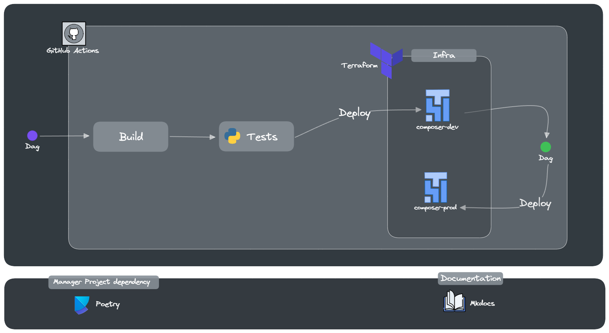

# Composer CI/CD

## Descrição
Este projeto automatiza o processo de implantação de DAGs do Cloud Composer usando pipelines de CI/CD. Ele envolve a criação de instâncias do Composer via Terraform, configuração de DAGs de exemplo e arquivos de teste utilizando pytest, e configuração de jobs de CI/CD para ambientes de desenvolvimento e produção com github actions.

## Arquitetura do Projeto



## Infraestrutura do Cloud Composer

Toda a infraestrutura do Cloud Composer é provisionada utilizando o Terraform, o que proporciona uma abordagem automatizada e escalável para configurar e gerenciar ambientes de fluxo de trabalho.

### Arquivo `main.tf`

O arquivo `main.tf` contém a definição dos recursos necessários para configurar o ambiente do Cloud Composer, incluindo a criação do bucket do Cloud Storage, a configuração da conta de serviço e a definição do ambiente do Composer.

??? example "create_composer_instance/main.tf"
    ```hcl
    provider "google" {
    project     = var.project_id
    region      = var.region
    }

    # Create bucket composer
    resource "google_storage_bucket" "create_bucket" {
    name                        = var.bucket_name_composer
    location                    = var.region
    uniform_bucket_level_access = true
    force_destroy               = false
    }

    # Create service account composer
    resource "google_service_account" "sa_composer" {
    account_id   = var.sa_composer_name
    display_name = "Create Service Account for Composer Environment"
    }

    # Attach role worker in service account composer
    resource "google_project_iam_member" "attach_role_composer-worker" {
    project = var.project_id
    role    = "roles/composer.worker"
    member  = "serviceAccount:${google_service_account.sa_composer.email}"
    }

    # Create composer instance
    resource "google_composer_environment" "cluster_config_composer" {
    project = var.project_id
    name   = var.composer_name
    region = var.region
    provider = google-beta
    labels = {env = var.work_environ}

    storage_config {
        bucket  = google_storage_bucket.create_bucket.name
        }

    config {

        software_config {
            image_version = var.image_version_composer
            airflow_config_overrides = {
                core-dags_are_paused_at_creation = "True"
                secrets-backend                  =  "airflow.providers.google.cloud.secrets.secret_manager.CloudSecretManagerBackend"
                secrets-backend_kwargs           =  "{'project_id': '${var.project_id}', 'connections_prefix':'airflow-connections', 'variables_prefix':'airflow-variables', 'sep':'-'}"
            }

            env_variables = {
                work_environ = var.work_environ
            }
        }

        workloads_config {
            scheduler {
            cpu        = 1
            memory_gb  = 2
            storage_gb = 2
            count      = 1
            }
            web_server {
            cpu = 1
            memory_gb = 2
            storage_gb = 2
            }

            worker {
                cpu = 1
                memory_gb = 2
                storage_gb = 2
                min_count = 1
                max_count = 3
            }
            triggerer {
                cpu = 0.5
                memory_gb = 0.5
                count = 1
            }
        }
        environment_size = "ENVIRONMENT_SIZE_SMALL"
    }
    }
    ```

### Arquivo `backend.tf`

O arquivo `backend.tf` especifica a configuração do backend para o Terraform, indicando onde armazenar o estado do Terraform.

```hcl
terraform {
  backend "gcs" {
    bucket  = "personal-terraform-backend"
    prefix  = "state"
  }
}
```
!!! warning "Criação do bucket"
     É importante destacar que para utilizar o backend é necessário ter um bucket criado no Google Cloud Storage.

### Arquivos `variables.tf` e `.tfvars`

Os arquivos `variables.tf` e `.tfvars` desempenham um papel fundamental na definição e configuração das variáveis utilizadas para a criação da infraestrutura do Cloud Composer. Enquanto o arquivo `variables.tf` define as variáveis e seus tipos, o arquivo `.tfvars` especifica os valores dessas variáveis para cada ambiente, como desenvolvimento (dev) e produção (prod).

#### Arquivo `variables.tf`

No arquivo `variables.tf`, são declaradas todas as variáveis que serão utilizadas no Terraform para configurar a infraestrutura do Cloud Composer. Essas variáveis incluem informações como o ID do projeto, a região, o nome do bucket do Cloud Storage, o nome da conta de serviço e outras configurações necessárias.

??? Example "Exemplo de declaração de variáveis no arquivo `variables.tf`"
    ```hcl
    variable "project_id" {
    description = "ID do projeto do Google Cloud"
    type        = string
    }

    variable "region" {
    description = "Região do Google Cloud para implantar o ambiente do Composer"
    type        = string
    }

    variable "bucket_name_composer" {
    description = "Nome do bucket do Cloud Storage para o ambiente do Composer"
    type        = string
    }

    // Outras variáveis necessárias...
    ```

#### Arquivo `.tfvars`

Já no arquivo `.tfvars`, são atribuídos os valores específicos das variáveis para cada ambiente, permitindo a personalização e a diferenciação entre ambientes, como desenvolvimento e produção. Isso facilita a manutenção e o gerenciamento de múltiplos ambientes com configurações distintas.

Exemplo de atribuição de valores de variáveis para o ambiente de desenvolvimento:

```hcl title="create_composer_instance/dev.tfvars"
project_id            = "meu-projeto-dev"
region                = "us-central1"
bucket_name_composer  = "meu-bucket-dev"
```

Exemplo de atribuição de valores de variáveis para o ambiente de produção:

```hcl title="create_composer_instance/prod.tfvars"
project_id            = "meu-projeto-prod"
region                = "us-central1"
bucket_name_composer  = "meu-bucket-prod"
```
!!! tip "Substitua as variáveis"
    Ao utilizar o projeto, substitua os valores das variáveis dos arquivos com extensão ``tfvars``.
## Testes Automatizados

Neste projeto, os testes automatizados são realizados utilizando a biblioteca pytest. Eles são essenciais para garantir a integridade e o funcionamento correto das DAGs (Directed Acyclic Graphs) que compõem o fluxo de trabalho do Cloud Composer.

### Tipos de Testes Realizados

**Teste de Importação**:
Este teste valida a integridade das DAGs verificando se há erros de importação nos arquivos localizados no diretório `dags`. Ao garantir que as DAGs possam ser importadas corretamente, minimizamos a ocorrência de erros durante a execução das tarefas agendadas.

```python title="tests/test_dag_import_errors.py"
import os
import pytest
from airflow.models import DagBag

def get_import_errors():
    dag_bag = DagBag(include_examples=False)

    def strip_path_prefix(path):
        return os.path.relpath(path, os.environ.get("AIRFLOW_HOME"))

    return [(None, None)] + [
        (strip_path_prefix(k), v.strip()) for k, v in dag_bag.import_errors.items()
    ]

@pytest.mark.parametrize(
    "rel_path,rv", get_import_errors(), ids=[x[0] for x in get_import_errors()]
)
def test_import_erros(rel_path, rv):

    if rel_path and rv:
        raise Exception(f"{rel_path} failed to import with message \n {rv}")
```
**Teste de Tags**:
O teste de tags verifica se todas as DAGs estão adequadamente etiquetadas. As tags são metadados atribuídos às DAGs que ajudam a organizar e categorizar as tarefas do fluxo de trabalho. Este teste garante que todas as DAGs estejam devidamente identificadas, facilitando a sua gestão e manutenção.

```python title="tests/test_dag_tags.py"
import os
import pytest
from airflow.models import DagBag

def get_dags():
    dag_bag = DagBag(include_examples=False)

    def strip_path_prefix(path):
        return os.path.relpath(path, os.environ.get("AIRFLOW_HOME"))

    return [(k, v, strip_path_prefix(v.fileloc)) for k, v in dag_bag.dags.items()]

@pytest.mark.parametrize(
    "dag_id,dag,fileloc", get_dags(), ids=[x[2] for x in get_dags()]
)
def test_dag_tags(dag_id, dag, fileloc):
    assert dag.tags, f"{dag_id} in {fileloc} has no tags"
```

Esses testes automatizados são fundamentais para garantir a estabilidade e a confiabilidade do processo de implantação automatizada das DAGs no ambiente do Cloud Composer. Eles contribuem para a detecção precoce de problemas e ajudam a manter a qualidade do código ao longo do tempo.

!!! warning "Possíveis problemas em ambientes Windows"
    Em ambientes Windows, pode ocorrer de os testes não funcionarem corretamente devido a diferenças de comportamento do Apache Airflow nesse sistema operacional. Um erro comum é o `ModuleNotFoundError: No module named 'fcntl'`, que pode ser causado por incompatibilidades entre o Airflow e o ambiente Windows.

    Esses problemas são geralmente relacionados à falta de suporte para certos recursos específicos do sistema operacional Unix, como o módulo `fcntl`, que não está disponível no Windows.

    Recomenda-se verificar a documentação do Apache Airflow para possíveis soluções alternativas ou considerar a execução dos testes em um ambiente Unix-like, como Linux ou macOS, onde o Airflow é mais comumente utilizado e testado.

## Fluxo do CI/CD

### Pipeline para Ambiente de Desenvolvimento

O pipeline `pipeline-composer-dags-dsv.py` é responsável por implantar as DAGs no ambiente de desenvolvimento. Ele é acionado automaticamente em eventos de push para a branch `develop`, permitindo a implantação de alterações em um ambiente isolado de produção. Este pipeline é desencadeado quando ocorrem alterações nos seguintes arquivos ou diretórios:

```yaml
on:
  push:
    branches: ["develop"]
    paths:
      - "dags/*"
      - "tests/*"
      - "requirements.txt"
      - "requirements-test.txt"
      - ".github/workflows/pipeline-composer-dags-dsv.yml"
  workflow_dispatch:
```

Este pipeline realiza as seguintes etapas:

#### 1. Clone do Repositório

```yaml
jobs:
  build-and-deploy:
    steps:
      - uses: actions/checkout@v4
```

#### 2. Configuração do Ambiente Python e Instalação de Dependências

```yaml
jobs:
  build-and-deploy:
    steps:
      - uses: actions/setup-python@v5
        with:
          python-version: '3.10'

      - name: Install dependencies
        run: |
          pip install -r requirements.txt
          pip install -r requirements-test.txt
```

#### 3. Definição da Variável de Ambiente `AIRFLOW_HOME`

```yaml
jobs:
  build-and-deploy:
    steps:
      - name: Set AIRFLOW_HOME
        run: echo "AIRFLOW_HOME=${AIRFLOW_HOME}" >> $GITHUB_ENV
```

#### 4. Execução dos Testes Unitários nas DAGs

```yaml
jobs:
  build-and-deploy:
    steps:
      - name: Run tests
        run: |
          python -m pytest tests/
```

#### 5. Autenticação no Google Cloud

```yaml
jobs:
  deploy-to-gcs:
    steps:
      - uses: google-github-actions/auth@v2
        with:
          credentials_json: ${{ secrets.GCP_SA_KEY }}
```

#### 6. Configuração do Cloud SDK

```yaml
jobs:
  deploy-to-gcs:
    steps:
      - uses: google-github-actions/setup-gcloud@v2
```

#### 7. Upload das DAGs para o Cloud Storage

```yaml
jobs:
  deploy-to-gcs:
    steps:
      - run: |
          gsutil -m rsync -r -x "__pycache__" dags ${{ env.DAGS_BUCKET_PATH }}
```

### Pipeline para Ambiente de Produção

O pipeline `pipeline-composer-dags-prd.py` é responsável por implantar as DAGs no ambiente de produção. Ele é acionado automaticamente em eventos de pull request para a branch `main`, garantindo que apenas as alterações validadas sejam implantadas no ambiente de produção. Este pipeline é desencadeado quando ocorrem alterações nos seguintes arquivos ou diretórios:

```yaml
on:
  pull_request:
    branches: ["main"]
    paths:
      - "dags/*"
      - "tests/*"
      - "requirements.txt"
      - "requirements-test.txt"
      - ".github/workflows/pipeline-composer-dags-prd.yml"
```

Este pipeline realiza as seguintes etapas:

#### 1. Clone do Repositório

```yaml
jobs:
  deploy-to-gcs:
    steps:
      - uses: actions/checkout@v4
```

#### 5. Autenticação no Google Cloud e Configuração do Cloud SDK

(Autenticação e configuração são semelhantes aos passos do pipeline de produção)

#### 6. Upload das DAGs para o Cloud Storage

(Semelhante ao passo de upload no pipeline de produção)

!!! note "Configuração de Segredo e Variáveis no GitHub Actions"
    Para o funcionamento correto do CI/CD certifique-se de criar uma service account específica para o projeto no Google Cloud Platform e armazená-la no secret do GitHub Actions. Isso é essencial para garantir que o pipeline de CI/CD tenha acesso às credenciais necessárias para interagir com os recursos do GCP. Além disso, não se esqueça de definir as variáveis de ambiente `DAGS_BUCKET_PATH_DEV` e `DAGS_BUCKET_PATH_PROD` no GitHub Actions, para especificar os caminhos dos buckets onde as DAGs serão armazenadas nos ambientes de desenvolvimento e produção, respectivamente.

## Considerações finais

!!! tip "Leia o README do Repositório"
    Para obter informações sobre como instalar e utilizar o projeto, não deixe de ler o README no repositório oficial do projeto.

Esta documentação fornece uma visão abrangente do projeto, abordando aspectos como a arquitetura, a infraestrutura, os testes automatizados, os fluxos de CI/CD e muito mais. Esperamos que este guia seja útil para entender e utilizar o projeto de forma eficaz.

Se você tiver alguma dúvida, problema ou sugestão, não hesite em entrar em contato.